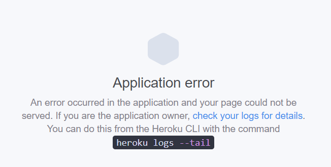

# Отчет по лабораторной работе №2

## Инструкции по запуску проекта

__1. Убедитесь, что у вас установлен [Node.js](https://nodejs.org/en/download). Если нет, скачайте и установите его с официального сайта.__ 

__2. Склонируйте данный репозиторий или скачайте архив.__

__3. Перейдите в каталог проекта через командную строку.__

__4. Установите зависимости, введя команду:__
```bash
npm install
```

__5. Запустите приложение можно, открыв файл index.html в любом современном веб-браузере или через расширение Live Server прямо из vscode__


## Описание индивидуальной работы

__Тема:__ Активности для Капитана Смита

__Цель:__ Ознакомить студентов с продвинутыми функциями JavaScript, включая асинхронный JavaScript, модули и обработку ошибок.

Планировалось создать приложение, которое предлагает капитану Смиту различные занятия для разнообразия его дневной рутины. Однако, изначально запланированное [API](https://www.boredapi.com/api/activity/) для получения этих занятий стало недоступно: 



В связи с этим, я решил использовать другое [API](https://catfact.ninja/fact), которое предоставляет случайные факты о кошках. Теперь при каждом обновлении страницы капитан Смит будет получать новый и интересный факт о кошках вместо предложений о различных занятиях.

## Краткая документация к проекту

__Структура проекта:__
- `index.html`: Основной файл HTML с основной структурой веб-страницы.
- `index.css`: Файл стилей для определения внешнего вида страницы.
- `src/`: Директория, содержащая JavaScript файлы.
  - `src/index.js`: Основной JavaScript файл, в котором осуществляется вызов функции обновления активности.
  - `src/activity.js`: JavaScript файл с логикой получения данных о случайном факте о кошках.
- `README.md`: Файл с описанием структуры проекта, его функциональности и инструкциями по использованию.

Приложение предоставляет следующие функции:

- __activity.js__
  - `getRandomActivity(url = "")`: Получает случайную активность из указанного URL. Возвращает Promise<string>.
  - `updateActivity(url = "https://catfact.ninja/fact")`: Обновляет активность на веб-странице. Возвращает Promise<void>.

- __index.js__
  - `updateActivity()`: Запускает функцию обновления активности сразу после загрузки страницы и затем каждую минуту. Не возвращает значения.
  - `setTimeout(updateActivity, 60000)`: Запускает функцию обновления активности каждые 60 секунд. Возвращает идентификатор таймера (number).

## Примеры использования проекта с приложением скриншотов или фрагментов кода

В данном случае не требуется предоставление фрагментов кода или скриншотов. Достаточно запустить проект и ознакомиться с результатом. В файлах `activity.js` и `index.js` содержится полная документация в формате JSDoc.

## Ответы на контрольные вопросы

1. __Какое значение возвращает функция fetch?__
- _Функция `fetch` возвращает объект типа Promise. Этот объект представляет асинхронную операцию получения ресурса с сервера._

2. __Что представляет собой Promise?__
- _`Promise` - это объект, представляющий завершившееся или не завершившееся асинхронное событие и его результат._
     
3. __Какие методы доступны у объекта Promise?__
- _Основные методы объекта Promise:_

  - _then(): вызывается при успешном выполнении операции._
  - _catch(): вызывается при возникновении ошибки._
  - _finally(): вызывается в любом случае (независимо от того, было ли успешное выполнение или возникла ошибка)._
   
4. __Каковы основные различия между использованием async / await и Promise?__
- _Основное различие между async / await и Promise заключается в синтаксисе и читаемости кода. async / await обеспечивает более линейный и читаемый код, делая его более схожим с синхронным стилем программирования. Кроме того, async / await позволяет параллельное выполнение асинхронных операций, что улучшает производительность. Этот подход также соответствует лучшим практикам JavaScript._

## Список использованных источников
- [Что такое промисы в JavaScript.](https://www.youtube.com/watch?v=4X7OjIjjaQE): 
Наверное одно из самых лучших обьяснений в формате видео, о том что такое Promise.
- [MDN Web Docs](https://developer.mozilla.org/): 
Официальная документация по JavaScript и веб-разработке.
- [GitHub Docs](https://docs.github.com/): 
Официальная документация по Git и GitHub.